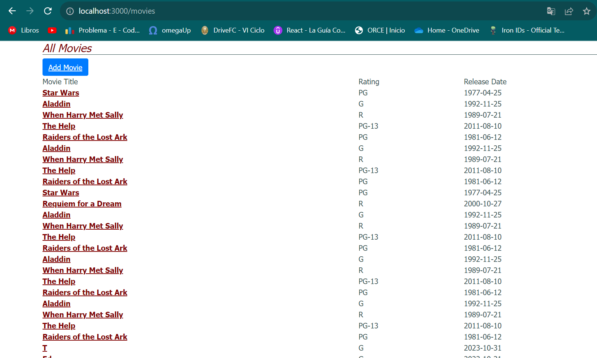
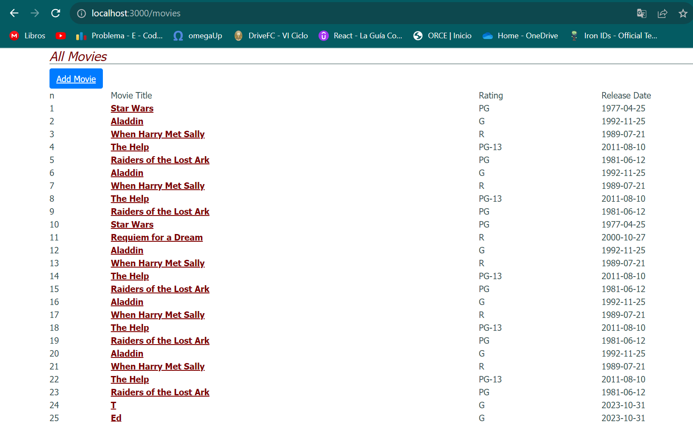
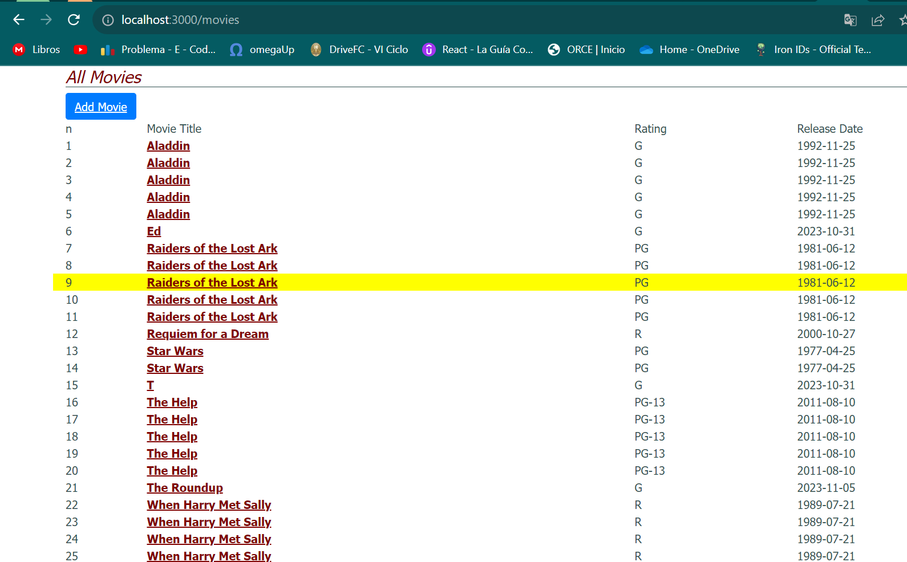

# Pregunta 1:  
# Pregunta 2: Diseño de Clases en JavaScript: Pokemon y Charizard

## Clase `Pokemon`

La clase `Pokemon` representa a un Pokémon en el mundo de las batallas. Aquí están los pasos para su implementación:

### Constructor

El constructor de la clase `Pokemon` toma tres parámetros (`hp`, `ataque`, `defensa`) y inicializa seis campos (`hp`, `ataque`, `defensa`, `movimiento`, `nivel`, `tipo`). Los valores de (`movimiento`, `nivel`, `tipo`) se inicializan en ("", 1, "").

```javascript
class Pokemon {
    constructor(hp, ataque, defensa) {
        this.hp = hp;
        this.ataque = ataque;
        this.defensa = defensa;
        this.movimiento = "";
        this.nivel = 1;
        this.tipo = "";
    }
}
```
### Método fight
Implementa un método llamado fight que arroja un error si no se especifica ningún movimiento.

```javascript
class Pokemon {
    // Constructor
    fight(){
        if(this.movimiento === ""){
            throw new Error("No hay nigun movimiento")
        }
    }
}
```

### Método canFly
Implementa un método llamado `canFly` que verifica si se especifica un tipo. Si no, arroja un error. Si es así, verifica si el tipo incluye ‘flying’. Devuelve `true` si es flying, ``false`` si no.

```javascript
class Pokemon {
    // Constructor
    canFLy(){
        if(this.tipo === ""){
            throw new Error("No se especificó el tipo")
        }
        return this.tipo === "flying";
    }
}
```

### Clase Charizard (Herencia)
La clase Charizard hereda de la clase Pokemon:

#### Constructor
El constructor de la clase Charizard toma cuatro parámetros ``(hp, ataque, defensa, movimiento)`` y configura el movimiento y el tipo ``(volador)``. Luego, llama al constructor de la superclase ``(Pokemon)`` para establecer ``hp, ataque, y defensa.``

```javascript
class Charizard extends Pokemon {
    constructor(hp, ataque, defensa, movimiento) {
        super(hp, ataque, defensa);
        this.movimiento = movimiento;
        this.tipo = "volador";
    }
}
```
#### Método fight (Sobreescritura)
Sobreescribe el método fight de la superclase Pokemon. Si se especifica un movimiento, imprime una declaración que indica que se está utilizando el movimiento y devuelve el campo ``ataque``. Si no, arroja un error.

```javascript
class Charizard extends Pokemon {
    constructor(hp, ataque, defensa, movimiento) {
        super(hp, ataque, defensa);
        this.movimiento = movimiento;
        this.tipo = "flying";
    }

    fight(){
        super.fight();
        console.log(`Se usó ${this.movimiento} con un ataque de ${this.ataque}`)
    }
}
```
# Pregunta 3:
# Pregunta 4: Modificacion de la lista de peliculas

Modifique la lista de películas de la siguiente manera. Cada modificación va a necesitar que realice un cambio en una capa de abstracción diferente
- Modifica la vista Index para incluir el número de fila de cada fila en la tabla de películas.

Nuestra archivo `index.html.erb` inicialmente es asi:

```html
<h1>All Movies</h1>

<%= link_to 'Add Movie', new_movie_path, :class => 'btn btn-primary' %>

<div id="movies">
  <div class="row">
    <div class="col-6">Movie Title</div>
    <div class="col-2">Rating</div>
    <div class="col-2">Release Date</div>
  </div>
  <%- @movies.each do |movie| %>
    <div class="row">
      <div class="col-6"> <%= link_to movie.title, movie_path(movie), data: { method: 'get' } %> </div>
      <div class="col-2"> <%= movie.rating %></div>
      <div class="col-2"> <%= movie.release_date.strftime('%F') %> </div>
    </div>
  <% end %>
</div>
```
Lo que nos da la siguiente vista:



Debemos agregar el `index` empezando por `1` de cada fila en la tabla de películas :

```html
<h1>All Movies</h1>

<%= link_to 'Add Movie', new_movie_path, :class => 'btn btn-primary' %>

<div id="movies">
  <div class="row">
    <div class="col-1">n</div> // numero de fila
    <div class="col-6">Movie Title</div>
    <div class="col-2">Rating</div>
    <div class="col-2">Release Date</div>
  </div>
  <%- @movies.each.with_index(1) do |movie, index| %>
    <div class="row">
      <div class="col-1"><%= index %></div> // numero de fila
      <div class="col-6"> <%= link_to movie.title, movie_path(movie), data: { method: 'get' } %> </div>
      <div class="col-2"> <%= movie.rating %></div>
      <div class="col-2"> <%= movie.release_date.strftime('%F') %> </div>
    </div>
  <% end %>
</div>
```

Lo que nos da la siguiente vista:


- Modifica la vista Index para que cuando se sitúe el ratón sobre una fila de la tabla, dicha fila cambie temporalmente su color de fondo a amarillo u otro color.

Para este cambio lo que necesitamos es modificar el estilo de la `row` cuando el ratón está sobre una fila de la tabla `hover`.

Modificamos el estilo en el archivo `app/assets/stylesheets/application.css`:

```css
.row:hover {
  background-color: yellow;
}
```

Lo cual nos proporciona esta vista:



- c.	Modifica la acción Index del controlador para que devuelva las películas ordenadas alfabéticamente por título, en vez de por fecha de lanzamiento. No intentes ordenar el resultado de la llamada que hace el controlador a la base de datos. Los gestores de bases de datos ofrecen formas para especificar el orden en que se quiere una lista de resultados y, gracias al fuerte acoplamiento entre ActiveRecord y el sistema gestor de bases de datos (RDBMS) que hay debajo, los métodos find y all de la biblioteca de ActiveRecord en Rails ofrece una manera de pedirle al RDBMS que haga esto.

En el código del controlador `movies_controller`, específicamente en la acción Index, modificamos la forma en que devolvemos las películas:

```ruby
# app/controllers/movies_controller.rb
class MoviesController < ApplicationController
  def index
    @movies = Movie.order(:title)
  end

end
```
Aquí, Movie.order(:title) es una llamada para ActiveRecord, que es la capa de abstracción de la base de datos en Rails. Esta llamada solicita a la base de datos que devuelva todas las películas ordenadas alfabéticamente por el campo title (título).

# Pregunta 4: Modificacion de la lista de peliculas 
## (para responder esta pregunta utiliza el repositorio y las actividades que has realizado de Rails avanzado, en particular asociaciones) - 2 puntos

1.	Extienda el código del controlador del código siguiente dado con los métodos edit y update para las críticas. Usa un filtro de controlador para asegurarte de que un usuario sólo puede editar o actualizar sus propias críticas. Revisa el código dado en la evaluación y actualiza tus repositorios de actividades (no se admite nada nuevo aquí). Debes mostrar los resultados. 


