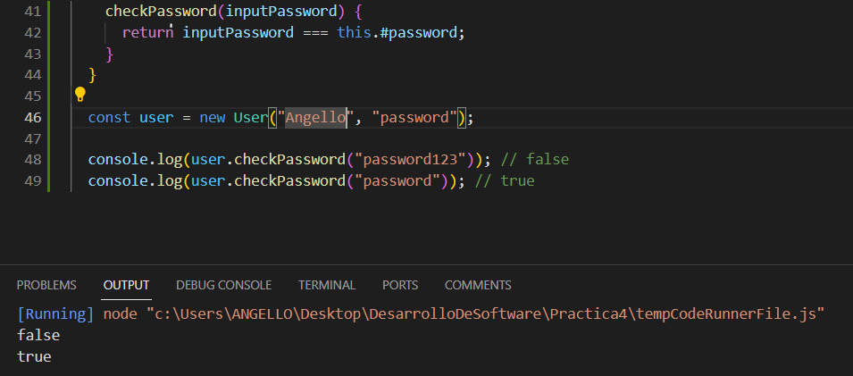

# Pregunta 1:  

```javascript
#!/usr/bin/env node

const fs = require('fs');

// Obtener los argumentos de la línea de comandos
const searchString = process.argv[2];
const files = process.argv.slice(3);

// Leer y buscar en los archivos
files.forEach((file) => {
  fs.readFile(file, 'utf8', (err, data) => {
    if (err) {
      console.error(`Error al leer el archivo ${file}: ${err}`);
      return;
    }
    const lines = data.split('\n');

    const matchingLines = lines.filter((line, lineNumber) => {
      if (line.includes(searchString)) {
        if (process.argv.includes('-n')) {
          line = `${lineNumber + 1}:${line}`;
        }
        return true;
      }
      return false;
    });

    // Mostrar las líneas coincidentes
    if (matchingLines.length > 0) {
      console.log(`Archivo: ${file}`);
      console.log(matchingLines.join('\n'));
      console.log();
    }
  });
});
```

Utilizamos process.argv para recuperar los argumentos de la línea de comandos. process.argv[2] contiene la cadena de búsqueda y process.argv.slice(3) contiene los nombres de los archivos en los que se buscará.

Luego, iteramos sobre cada archivo y usamos fs.readFile para leer su contenido. Dividimos el contenido en líneas utilizando split('\n') y filtramos las líneas que contienen la cadena de búsqueda utilizando filter. Si se proporciona el indicador -n, agregamos el número de línea a las líneas coincidentes.

Finalmente, mostramos las líneas coincidentes agrupadas por archivo utilizando console.log.
# Pregunta 2: Diseño de Clases en JavaScript: Pokemon y Charizard

## Clase `Pokemon`

La clase `Pokemon` representa a un Pokémon en el mundo de las batallas. Aquí están los pasos para su implementación:

### Constructor

El constructor de la clase `Pokemon` toma tres parámetros (`hp`, `ataque`, `defensa`) y inicializa seis campos (`hp`, `ataque`, `defensa`, `movimiento`, `nivel`, `tipo`). Los valores de (`movimiento`, `nivel`, `tipo`) se inicializan en ("", 1, "").

```javascript
class Pokemon {
    constructor(hp, ataque, defensa) {
        this.hp = hp;
        this.ataque = ataque;
        this.defensa = defensa;
        this.movimiento = "";
        this.nivel = 1;
        this.tipo = "";
    }
}
```
### Método fight
Implementa un método llamado fight que arroja un error si no se especifica ningún movimiento.

```javascript
class Pokemon {
    // Constructor
    fight(){
        if(this.movimiento === ""){
            throw new Error("No hay nigun movimiento")
        }
    }
}
```

### Método canFly
Implementa un método llamado `canFly` que verifica si se especifica un tipo. Si no, arroja un error. Si es así, verifica si el tipo incluye ‘flying’. Devuelve `true` si es flying, ``false`` si no.

```javascript
class Pokemon {
    // Constructor
    canFLy(){
        if(this.tipo === ""){
            throw new Error("No se especificó el tipo")
        }
        return this.tipo === "flying";
    }
}
```

### Clase Charizard (Herencia)
La clase Charizard hereda de la clase Pokemon:

#### Constructor
El constructor de la clase Charizard toma cuatro parámetros ``(hp, ataque, defensa, movimiento)`` y configura el movimiento y el tipo ``(volador)``. Luego, llama al constructor de la superclase ``(Pokemon)`` para establecer ``hp, ataque, y defensa.``

```javascript
class Charizard extends Pokemon {
    constructor(hp, ataque, defensa, movimiento) {
        super(hp, ataque, defensa);
        this.movimiento = movimiento;
        this.tipo = "volador";
    }
}
```
#### Método fight (Sobreescritura)
Sobreescribe el método fight de la superclase Pokemon. Si se especifica un movimiento, imprime una declaración que indica que se está utilizando el movimiento y devuelve el campo ``ataque``. Si no, arroja un error.

```javascript
class Charizard extends Pokemon {
    constructor(hp, ataque, defensa, movimiento) {
        super(hp, ataque, defensa);
        this.movimiento = movimiento;
        this.tipo = "flying";
    }

    fight(){
        super.fight();
        console.log(`Se usó ${this.movimiento} con un ataque de ${this.ataque}`)
    }
}
```
# Pregunta 3:
# Pregunta 4: Modificacion de la lista de peliculas

Modifique la lista de películas de la siguiente manera. Cada modificación va a necesitar que realice un cambio en una capa de abstracción diferente
- Modifica la vista Index para incluir el número de fila de cada fila en la tabla de películas.

Nuestra archivo `index.html.erb` inicialmente es asi:

```html
<h1>All Movies</h1>

<%= link_to 'Add Movie', new_movie_path, :class => 'btn btn-primary' %>

<div id="movies">
  <div class="row">
    <div class="col-6">Movie Title</div>
    <div class="col-2">Rating</div>
    <div class="col-2">Release Date</div>
  </div>
  <%- @movies.each do |movie| %>
    <div class="row">
      <div class="col-6"> <%= link_to movie.title, movie_path(movie), data: { method: 'get' } %> </div>
      <div class="col-2"> <%= movie.rating %></div>
      <div class="col-2"> <%= movie.release_date.strftime('%F') %> </div>
    </div>
  <% end %>
</div>
```
Lo que nos da la siguiente vista:


Debemos agregar el `index` empezando por `1` de cada fila en la tabla de películas :

```html
<h1>All Movies</h1>

<%= link_to 'Add Movie', new_movie_path, :class => 'btn btn-primary' %>

<div id="movies">
  <div class="row">
    <div class="col-1">n</div> // numero de fila
    <div class="col-6">Movie Title</div>
    <div class="col-2">Rating</div>
    <div class="col-2">Release Date</div>
  </div>
  <%- @movies.each.with_index(1) do |movie, index| %>
    <div class="row">
      <div class="col-1"><%= index %></div> // numero de fila
      <div class="col-6"> <%= link_to movie.title, movie_path(movie), data: { method: 'get' } %> </div>
      <div class="col-2"> <%= movie.rating %></div>
      <div class="col-2"> <%= movie.release_date.strftime('%F') %> </div>
    </div>
  <% end %>
</div>
```

Lo que nos da la siguiente vista:


- Modifica la vista Index para que cuando se sitúe el ratón sobre una fila de la tabla, dicha fila cambie temporalmente su color de fondo a amarillo u otro color.

Para este cambio lo que necesitamos es modificar el estilo de la `row` cuando el ratón está sobre una fila de la tabla `hover`.

Modificamos el estilo en el archivo `app/assets/stylesheets/application.css`:

```css
.row:hover {
  background-color: yellow;
}
```

Lo cual nos proporciona esta vista:


- c.	Modifica la acción Index del controlador para que devuelva las películas ordenadas alfabéticamente por título, en vez de por fecha de lanzamiento. No intentes ordenar el resultado de la llamada que hace el controlador a la base de datos. Los gestores de bases de datos ofrecen formas para especificar el orden en que se quiere una lista de resultados y, gracias al fuerte acoplamiento entre ActiveRecord y el sistema gestor de bases de datos (RDBMS) que hay debajo, los métodos find y all de la biblioteca de ActiveRecord en Rails ofrece una manera de pedirle al RDBMS que haga esto.

En el código del controlador `movies_controller`, específicamente en la acción Index, modificamos la forma en que devolvemos las películas:

```ruby
# app/controllers/movies_controller.rb
class MoviesController < ApplicationController
  def index
    @movies = Movie.order(:title)
  end

end
```
Aquí, Movie.order(:title) es una llamada para ActiveRecord, que es la capa de abstracción de la base de datos en Rails. Esta llamada solicita a la base de datos que devuelva todas las películas ordenadas alfabéticamente por el campo title (título).

# Pregunta 4: Modificacion de la lista de peliculas 
## (para responder esta pregunta utiliza el repositorio y las actividades que has realizado de Rails avanzado, en particular asociaciones) - 2 puntos

1.	Extienda el código del controlador del código siguiente dado con los métodos edit y update para las críticas. Usa un filtro de controlador para asegurarte de que un usuario sólo puede editar o actualizar sus propias críticas. Revisa el código dado en la evaluación y actualiza tus repositorios de actividades (no se admite nada nuevo aquí). Debes mostrar los resultados. 

Para extender el código del controlador con los métodos edit y update para las críticas:

Agregamos el método edit:
```ruby
def edit
  @review = Review.find(params[:id])
end
```

Este método encuentra la crítica por su ID y la asigna a la variable de instancia ``@review``.

Agregamos el método update:
```ruby
def review_params
  params.require(:review).permit(:rating, :comment)
end

def update
  @review = Review.find(params[:id])

  if @review.update(review_params)
    redirect_to @review, notice: "Crítica actualizada exitosamente."
  else
    render :edit
  end
end

```
El método ``update`` encuentra la crítica por su ID y luego intenta actualizarla con los parámetros del método ``review_params``. Si la actualización tiene éxito, el usuario es redirigido a la página de la crítica actualizada con un mensaje de éxito. De lo contrario, se vuelve a renderizar la vista de edición.

Ahora implementamos un filtro en tu controlador para asegurarte de que un usuario solo pueda editar o actualizar sus propias críticas.

Agregamos el callback `before_action` al inicio:

```ruby
before_action :authorize_user, only: [:edit, :update]

def authorize_user
  @review = Review.find(params[:id])
  unless current_user == @review.moviegoer
    redirect_to root_path, alert: "No estás autorizado para realizar esta acción."
  end
end
```

Verificamos si el usuario actual es el mismo que el moviegoer asociado con la crítica. Si no son el mismo, el usuario es redirigido al path raíz con una alerta que indica que no están autorizados.

# Pregunta 5: Preguntas:
## 1.	Un inconveniente de la herencia de prototipos es que todos los atributos (propiedades) de los objetos son públicos. Sin embargo, podemos aprovechar las clausuras para obtener atributos privados. Crea un sencillo constructor para los objetos User que acepte un nombre de usuario y una contraseña, y proporcione un método checkPassword que indique si la contraseña proporcionada es correcta, pero que deniegue la inspección de la contraseña en sí. Esta expresión de “sólo métodos de acceso” se usa ampliamente en jQuery. Sugerencia:  El constructor debe devolver un objeto en el que una de sus propiedades es una función que aprovecha las clausuras de JavaScript para ‘recordar’ la contraseña proporcionada inicialmente al constructor. El objeto devuelto no debería tener ninguna propiedad que contenga la contraseña).

```javascript
class User {
  #password;

  constructor(username, password) {
    this.#password = password;
  }

  checkPassword(inputPassword) {
    return inputPassword === this.#password;
  }
}

const user = new User("Angello", "password");

console.log(user.checkPassword("password123")); // false
console.log(user.checkPassword("password")); // true
```

El constructor ``User`` acepta un nombre de usuario y una contraseña. Dentro del constructor, almacenamos la contraseña en una variable local llamada ``#password``. Luego, devolvemos un objeto que tiene un método ``checkPassword``. Este método compara la contraseña proporcionada como argumento con la contraseña almacenada y devuelve ``true`` si son iguales, de lo contrario, devuelve ``false``.

Debido a las clausuras, la variable ``#password`` se mantiene en memoria incluso después de que el constructor haya terminado de ejecutarse.

Podemos verlo:


## 3.	En el código utilizado en la sección de eventos y funciones callback, supongamos que no puedes modificar el código del servidor para añadir la clase CSS adult a las filas de la tabla movies. ¿Cómo identificaría las filas que están ocultas utilizando sólo código JavaScript del lado cliente?


Podemos identificar estas filas utilizando solo código JavaScript del lado del cliente. Una forma de hacerlo es buscar las filas ocultas basándote en alguna característica o propiedad específica de las filas ocultas.

```javascript
// Obtener todas las filas de la tabla
const rows = document.querySelectorAll('#moviesTable tbody tr');

// Filtrar las filas ocultas
const hiddenRows = Array.from(rows).filter(row => {
  return row.getAttribute('data-hidden') === 'true';
});

hiddenRows.forEach(row => {
  console.log(row);
});
```

Utilizamos ``document.querySelectorAll`` para seleccionar todas las filas de la tabla. Luego, utilizamos ``Array.from`` para convertir el resultado en un array y aplicamos el método ``filter`` para filtrar las filas ocultas.


